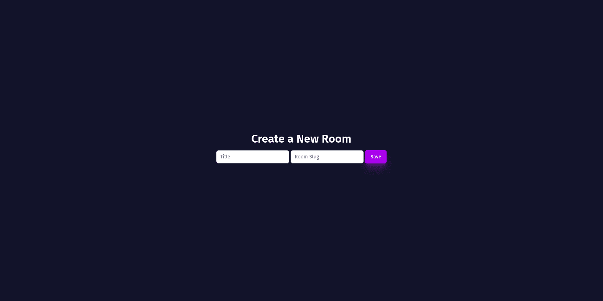
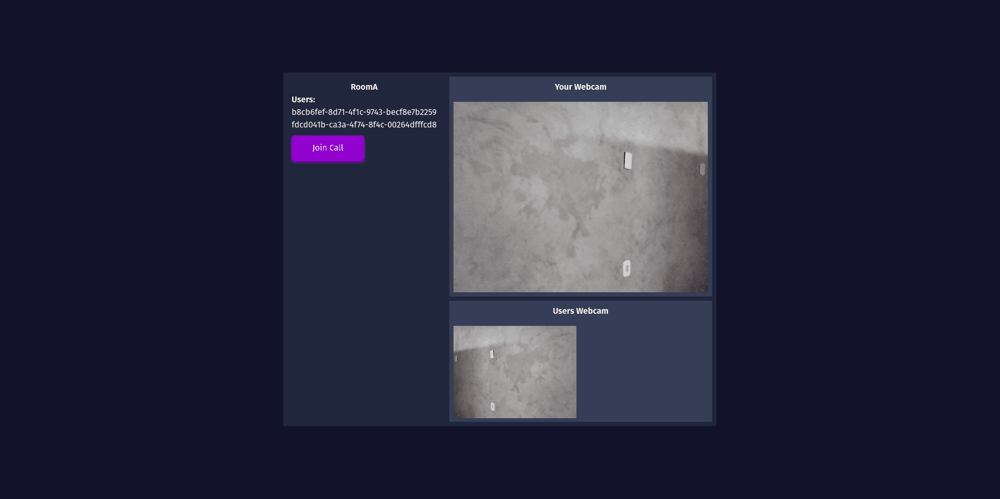

<p align="center">

<a href="https://github.com/RonaldGuilhermePDS/Petal-Voice-Chat">

<p align="center">

</p>
</a>

<h2 align="center">Welcome!</h2>

<p align="center">
Voice Chat built with Petal Stack that is combination of <a href="https://phoenixframework.org">Phoenix</a> + <a href="https://elixir-lang.org">Elixir</a> + <a href="https://tailwindcss.com">TailwindCSS</a> + <a href="https://alpinejs.dev">Alpine.JS</a> + <a href="https://hexdocs.pm/phoenix_live_view/Phoenix.LiveView.html">LiveView</a> + <a href="https://hexdocs.pm/stun">Stun</a> + <a href="https://webrtc.org">WebRTC</a>
</p>

<p align="center"><a href="https://github.com/RonaldGuilhermePDS/Petal-Voice-Chat/find/master"><strong><- Explore the docs -></strong></a></p>

<p align="center">
<a href="https://github.com/RonaldGuilhermePDS">Creator</a>
·
<a href="https://github.com/RonaldGuilhermePDS/Petal-Voice-Chat/issues">Report Bug</a>
·
<a href="https://github.com/RonaldGuilhermePDS/Petal-Voice-Chat/pulls">Request Feature</a>
</p>

<details open="open">
<summary>Table of Contents</summary>
<ol>
<li>
<a href="#about">About</a>
<ul>
<li><a href="#built-with">Built With</a></li>
</ul>
</li>
<li>
<a href="#getting-started">Getting Started</a>
<ul>
<li><a href="#installation">Installation</a></li>
</ul>
</li>
<li><a href="#screenshots">Screenshots</a></li>
<li><a href="#contributing">Contributing</a></li>
</ol>
</details>

## About

<a href="https://github.com/RonaldGuilhermePDS/Petal-Voice-Chat">Petal Voice Chat</a> is a **Project** for **Educational** purposes.

## Built With

* [Elixir](https://elixir-lang.org)
* [Phoenix](https://phoenixframework.org)
* [Live View](https://hexdocs.pm/phoenix_live_view/Phoenix.LiveView.html)
* [Alpine JS](https://alpinejs.dev)
* [Tailwind CSS](https://tailwindcss.com)
* [Stun](https://hexdocs.pm/stun)
* [WebRTC](https://webrtc.org)

## Getting Started

Follow the instructions to start the project without any problems.

## Installation

1. Clone the Repository
```sh
git clone https://github.com/RonaldGuilhermePDS/Petal-Voice-Chat.git
```
2. Install Packages
```sh
mix deps.get
```
3. Create and migrate your database
```sh
mix ecto.setup
```
4. Run
```sh
mix phx.server
```

## Screenshots

New Page



Room Page




## Contributing

Contributions are what make the open source community such an amazing place to be learn, inspire, and create. Any contributions you make are **greatly appreciated**.

1. Fork the Project
2. Create your Feature Branch (`git checkout -b feature/AmazingFeature`)
3. Commit your Changes (`git commit -m 'Add some AmazingFeature'`)
4. Push to the Branch (`git push origin feature/AmazingFeature`)
5. Open a Pull Request
